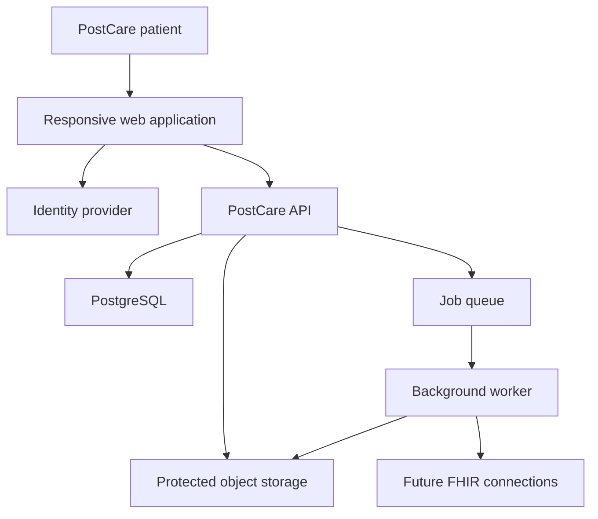

# PostCare Technical Architecture

## Status

**Decision state:** Proposed foundation for founder approval  
**Architecture stage:** Pre-production prototype  
**Initial market:** United States  
**Initial user:** Individual adult managing their own record  

## 1. Architecture goals

PostCare must support a fast early-stage product cycle without creating a security or interoperability dead end. The first production architecture should:

- Keep health records isolated by patient at every layer.
- Preserve the original source and revision history of every record.
- Support structured records and protected original documents.
- Allow FHIR-based provider and payer integrations later.
- Produce a complete, user-visible access history.
- Scale services independently only after real usage justifies it.
- Remain testable with synthetic data before accepting real health information.

## 2. Recommended architectural style

Start with a **modular monolith** rather than microservices.

The application deploys as a small number of processes, but the code is separated into strict modules with explicit interfaces. This gives the early startup one transaction boundary, one primary database, simpler operations, and faster development. Modules can later be extracted into services when load, team ownership, regulatory isolation, or reliability requirements justify the cost.

### Initial deployable units

1. Responsive web client
2. Backend API
3. Background worker
4. PostgreSQL database
5. Encrypted object storage
6. Queue and scheduled-job infrastructure

## 3. Proposed technology stack

| Layer | Initial choice | Reason |
|---|---|---|
| Web client | React and TypeScript | Already used by the prototype; strong component and accessibility ecosystem |
| Web framework | Next-compatible application structure | Supports server and client rendering while preserving the current prototype investment |
| Backend | TypeScript API modules | One language across the early product reduces startup overhead and shared-type drift |
| API contract | OpenAPI 3.1 with generated clients | Makes authorization, validation, documentation, and testing explicit |
| Primary database | PostgreSQL | Transactions, constraints, indexing, JSON support, row-level security options, and mature operations |
| Database access | Drizzle or another typed SQL layer | Keeps schema and queries explicit without hiding relational behavior |
| Document storage | Private encrypted object storage | Appropriate for PDFs, images, exports, and immutable originals |
| Async work | Managed queue plus worker | Upload scanning, imports, OCR, export generation, and notifications must not block requests |
| Cache | None initially; managed Redis only when measured | Avoids premature state and invalidation complexity |
| Authentication | Managed OpenID Connect identity provider | MFA, passkeys, recovery, session security, and reduced credential-handling scope |
| Observability | Structured logs, metrics, tracing, and security alerts | Required for operations and incident response |
| Infrastructure | Infrastructure as code with separate environments | Reproducibility, reviewability, and controlled change history |

The hosted prototype may continue using its current platform. A production environment that accepts real health information must be selected only after vendor, contract, regulatory, security, backup, and incident-response review.

## 4. System context

## 5. Backend modules

### Identity and sessions

- Maps external identity subjects to internal users.
- Enforces recent authentication for sensitive actions.
- Manages sessions, devices, recovery state, and security events.
- Never stores identity-provider credentials in application tables.

### Patient profiles

- Stores the individual adult's profile and preferences.
- Keeps identity data separate from clinical data where practical.
- Owns emergency contacts and emergency-profile configuration.

### Clinical records

- Conditions
- Allergies and intolerances
- Medications
- Immunizations
- Procedures
- Encounters
- Observations and measurements
- Diagnostic reports
- Appointments

Every record must include patient ownership, source, effective time, recorded time, verification state, lifecycle state, and revision metadata.

### Documents

- Owns document metadata and associations.
- Issues short-lived upload and download authorization.
- Preserves protected originals.
- Coordinates quarantine, type detection, malware scanning, preview generation, and later OCR.
- Never treats an OCR result as confirmed clinical data without an explicit confirmation workflow.

### Provenance

- Records who or what created each item.
- Distinguishes patient-entered, uploaded, imported, and system-derived information.
- Links derived information to its inputs.
- Preserves correction flags and patient annotations without rewriting original records.

### Consent and authorization

- Centralizes access decisions.
- Enforces patient ownership in the API and database.
- Supports future sharing grants without adding ad hoc permission columns to every table.
- Records consent versions and revocation times.

### Timeline and search

- Produces the longitudinal view from canonical records.
- Uses approved structured fields and document metadata.
- Does not send protected record contents to third-party search services by default.

### Audit

- Receives security and data-access events.
- Uses append-only event semantics.
- Provides a simplified patient-facing access history and a more detailed operator view.
- Does not put raw health-record contents into logs.

### Integrations

- Isolates provider, payer, pharmacy, and laboratory connectors.
- Stores external identifiers by source system.
- Maps external FHIR resources into canonical PostCare records.
- Retains the unmodified source payload or a verifiable source reference according to policy.

## 6. Data architecture

### Canonical internal model

PostCare should use a canonical relational model influenced by FHIR rather than storing the entire application as arbitrary FHIR JSON. This allows strong constraints, reliable queries, and a user experience designed around patients. An integration layer maps between PostCare entities and FHIR resources.

### Core entity groups

| Group | Initial entities |
|---|---|
| Identity | users, identities, sessions, authenticators, devices |
| Patient | patient_profiles, emergency_contacts, preferences |
| Care network | practitioners, organizations, locations, patient_providers |
| Clinical | conditions, allergies, medications, immunizations, procedures, encounters, observations, diagnostic_reports, appointments |
| Documents | documents, document_versions, binary_objects, document_links |
| Trust | sources, provenance_events, annotations, correction_flags, verification_events |
| Access | consents, access_grants, access_policies, audit_events |
| Operations | outbox_events, jobs, import_runs, export_requests |

### Required common fields

Clinical and document entities should share, directly or through related tables:

- `id`
- `patient_id`
- `source_id`
- `effective_at` or explicit uncertain-date representation
- `recorded_at`
- `created_at`
- `updated_at`
- `created_by_actor_id`
- `verification_status`
- `lifecycle_status`
- `sensitivity_classification`
- `version`

### Record identifiers

- Use server-generated, non-sequential public identifiers.
- Never authorize access based only on identifier secrecy.
- Keep external identifiers scoped by source system.
- Make idempotency keys mandatory for retryable create and import operations.

## 7. Healthcare interoperability

PostCare integrations should target FHIR R4 and the applicable published US Core profiles for the chosen connection. SMART App Launch provides OAuth-based patterns for patient-facing FHIR authorization.

Initial resource mappings include:

| PostCare concept | FHIR resource |
|---|---|
| Patient profile | Patient |
| Provider | Practitioner and PractitionerRole |
| Organization | Organization |
| Visit | Encounter |
| Condition | Condition |
| Allergy | AllergyIntolerance |
| Medication | MedicationRequest and MedicationStatement where applicable |
| Immunization | Immunization |
| Measurement or result | Observation |
| Report | DiagnosticReport |
| Procedure | Procedure |
| Appointment | Appointment |
| Document metadata | DocumentReference |
| Source history | Provenance |
| Security event | AuditEvent |

Do not design integrations against an unversioned continuous-build guide. Pin every implementation to a specific published implementation-guide version and record it per connector.

## 8. Document processing flow

1. Authenticated client requests an upload authorization.
2. API creates a pending document record and returns a short-lived, size-limited upload target.
3. File enters a quarantine location.
4. Worker validates size, signature, detected type, and allowed format.
5. Malware scanning completes.
6. Approved file moves to protected storage using a server-controlled key.
7. Preview generation runs in an isolated worker.
8. Document status becomes ready.
9. Metadata and associations become searchable.
10. All state changes produce audit and outbox events.

Failed or rejected objects remain inaccessible to normal application reads and are removed according to a documented retention policy.

## 9. API design rules

- All authorization is enforced server-side.
- Use resource-oriented endpoints for user-facing workflows.
- Validate input at the trust boundary.
- Return stable machine-readable error codes plus safe user messages.
- Require idempotency keys for retryable writes.
- Use optimistic concurrency for record edits.
- Paginate timelines, records, documents, and audit history.
- Put exports, imports, scanning, and OCR behind asynchronous job resources.
- Version externally consumed APIs before compatibility becomes a constraint.
- Never expose internal object-storage locations.

## 10. Consistency and events

Use database transactions for record changes and an **outbox table** for events. A worker publishes committed outbox events to the job system. This prevents a record change from succeeding while its required downstream event is silently lost.

Events initially support:

- Audit ingestion
- Search-index updates
- Notifications
- Document processing
- Imports
- Export generation

## 11. Environment model

| Environment | Data policy | Purpose |
|---|---|---|
| Local | Synthetic only | Development |
| Test | Generated synthetic fixtures | Automated tests |
| Preview | Synthetic only | Product and design review |
| Staging | Synthetic by default; tightly controlled exceptions only after review | Production-like verification |
| Production | Real user data after launch approval | Customer use |

No production database copy may be used for routine development or demonstrations.

## 12. Scaling approach

1. Scale stateless API and worker processes horizontally.
2. Add database read replicas only after measured need.
3. Partition high-volume audit and timeline data only after measured need.
4. Extract document processing or integrations when workload isolation becomes valuable.
5. Avoid service extraction based solely on anticipated startup growth.

## 13. Initial implementation sequence

1. Refactor prototype into routes, shared components, typed view models, and synthetic fixtures.
2. Implement identity boundary and protected application shell.
3. Create PostgreSQL schema for users, patients, sources, provenance, audit, and the first clinical record types.
4. Implement conditions, medications, allergies, appointments, and providers end to end.
5. Add the quarantine-based document pipeline.
6. Add user-visible audit history, export, and deletion workflows.
7. Implement FHIR sandbox connections.
8. Complete launch security and legal readiness before real-data pilot.

## 14. References

- [HL7 FHIR R4 DocumentReference](https://hl7.org/fhir/R4/documentreference.html)
- [HL7 US Core](https://build.fhir.org/ig/HL7/US-Core/)
- [SMART App Launch](https://build.fhir.org/ig/HL7/smart-app-launch/)
- [OpenID FAPI 2.0 Security Profile](https://openid.net/specs/fapi-security-profile-2_0-final.html)
- [OWASP Application Security Verification Standard](https://owasp.org/www-project-application-security-verification-standard/)

